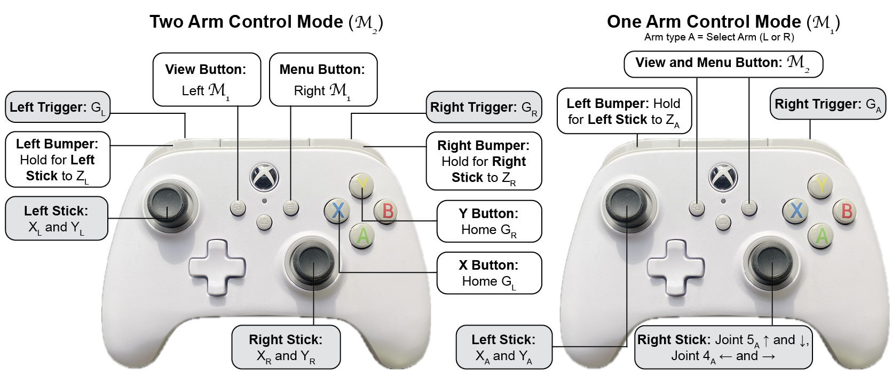

# Raven II Dual Platform Controller: control software for the Raven II robot
Author: Natalie Chalfant (chalf22n@mtholyoke.edu), Mai Bui (bui23m@mtholyoke.edu), Sean Fabrega, Yun-Hsuan Su 
(msu@mtholyoke.edu)
[](https://www.youtube.com/watch?v=eDtycxnpn8c&t)

## Description:
Raven II Dual Platform Controller is a Python client for controlling the Raven II robot using CRTK, and the simulated
Raven II robot in AMBF. It allows for realtime control using an Xbox controller as well as the ability to record and
replay trajectories across Raven II types. 

This controller has five main modes:
1. **Homing Mode**: return raven to its home position (stored in TYPE_raven_def.HOME_JOINTS)
2. **Manual Control**: use an xbox controller to control raven
3. **File Controller Inputs**: motion from a csv containing recorded controller inputs
4. **File jpos**: motion from a csv containing recorded jpos
5. **Sine Dance**: do a little dance :) (only enabled for AMBF simulated Raven II)

We also developed a 
[Data Analysis Tool](https://github.com/MHC-RobotSimulators-Research/Data_Analysis_MotionReplication) to rapidly analyze 
the trajectories recorded by Raven II Dual Platform Controller.

## Usage:

### Tested Platforms:
Raven II Dual Platform controller has been tested on Ubuntu 20.04 (Python 3.8 and ROS Noetic) and 22.04 
(Python 3.10 and ROS Noetic)

### Dependencies:
Requires ROS and a couple of ROS modules. Ensure you have ROS1 installed and build the 
[CRTK Python Client](https://github.com/collaborative-robotics/crtk_python_client), 
[CRTK Messages](https://github.com/collaborative-robotics/crtk_msgs), 
[Raven 2](https://github.com/uw-biorobotics/raven2) modules.

Additionally, numpy, pandas, rospy are required. They can be installed with pip3 as follows:
```
sudo pip3 install numpy pandas rospy
```

### Installation:
Clone this repository to your desired location
```
cd ~
git clone https://github.com/MHC-RobotSimulators-Research/Raven2_standardized_controller
```

### Launching:
The type of robot you wish to control is indicated with 2 flags at the end of the launch command, for the physical
Raven II use:
```
cd ~/Raven2_standardized_controller
python3 raven_controller.py 1 0     # For physical Raven II
```
And for the AMBF simulated Raven II use:
```
cd ~/Raven2_standardized_controller
python3 raven_controller.py 0 1     # For AMBF Simulated Raven II
```

## Controller Mapping:

